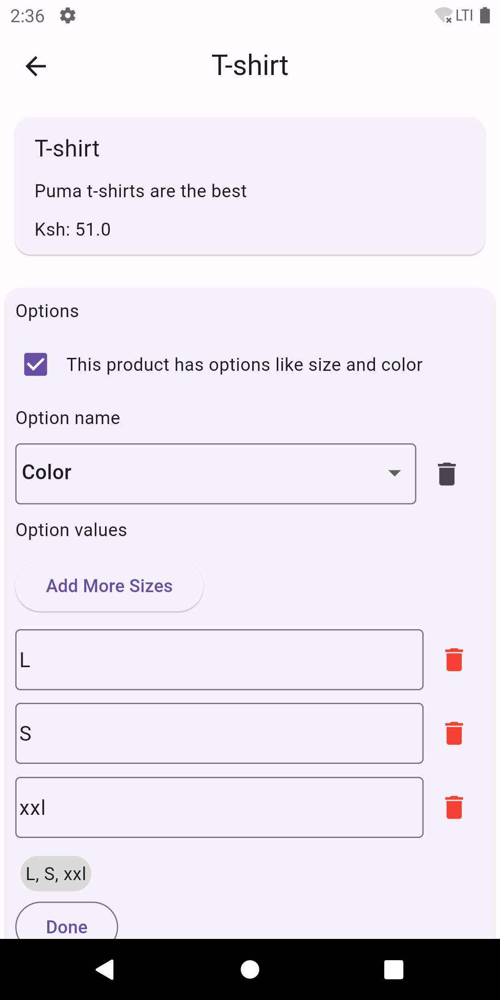
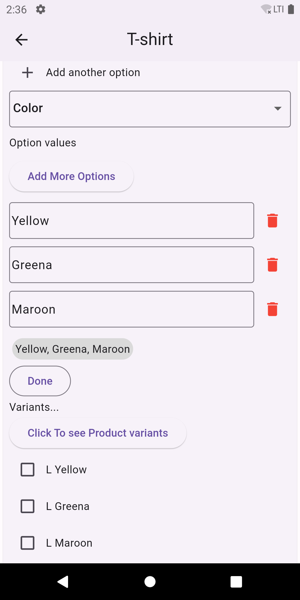

## Shopify Product Options and Variants App

### Description

This Flutter application is designed to replicate a key feature of an e-commerce platform, Shopify: the management of product options and variants. It allows users to add and manage products, along with their different options (like size, color, material, etc.) and the resulting product variants.

### Features

- **Add and Manage Products:** Users can add new products with details such as title, description, and price.
- **Product Options:** Functionality to add options to a product (e.g., size, color).
- **Dynamic Variant Generation:** Based on the selected options, the app dynamically generates product variants.
- **UI Elements:** The application includes a range of UI elements like forms, lists, checkboxes, dropdowns, and buttons to interact with the product data.

### Tech Stack

- **Flutter:** For building the app's UI and logic.
- **Dart:** The programming language used.
- **Provider Package:** For state management across the app.

### Screenshots

.
.

### Installation and Setup

1. Clone the repository to your local machine.
2. Navigate to the project directory.
3. Run flutter pub get to install dependencies.
4. Launch the app using flutter run.

### Usage

- **Home Screen:** View the list of added products and add new ones.
- **Product Detail Screen:** Add options to a product and view generated variants.
- **Adding Product:** Tap the '+' button to add a new product.
- **Adding Options and Variants:** In the product detail screen, users can add options and see the generated variants.
